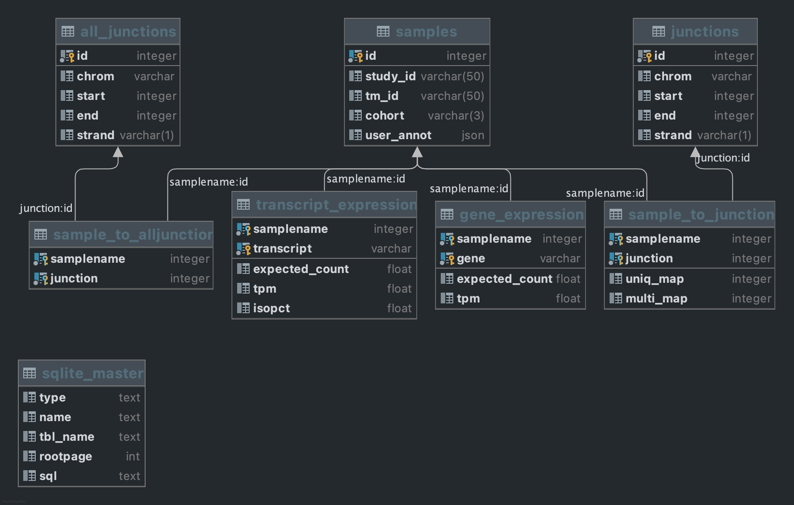

# Simple python package for storing and querying large RNA-Seq projects

This is a very early stage package that I've built to help me in my own work. It takes very specific inputs and is not 
flexible at all. In later versions I will try to address these issues if there is time.

## Create a project database
`create_project.py` creates a sqlite database with the schema below:



You will need several inputs, 

+ a samples csv this is hard coded to my project of interest will make it more flexible is priority
+ a filtered junctions file columns are chrom, start, end, strand, uniq_map, multi_map, samplename
+ gene expresssion file, columns are ensembl gene_id, expected_count, TPM, samplename
+ Isoform expression file same as genes and also isopct column

Expression files are long format concatananated RSEM outputs, junctions file is filtered (however you wish), concatanated
SJ.out.tab files from STAR aligner. 

You can create the databse as such:

```bash
python3 create_project.py -s {samplefile} -j {filtered_junctions_file} -a {all_junctions_file}\
    -g {gene_expresssion} -t {transcript_expression}, -o {output_name}
```

This script will create the project database, currently there is now way to add samples after creation that is second priority

## Querying the database

First you need to create a genome class from [pytxdb](https://github.com/celalp/pytxdb) and use that in your project class

```python
from sqlalchemy import create_engine
import pybiomart as biomart
from pytxdb import Genome
from clinpy import Project, Junction

db=create_engine("sqlite:///genome.db")
mart=dataset = biomart.Dataset(name='hsapiens_gene_ensembl',
                              host='http://grch37.ensembl.org')

genome=Genome(db, "hs37d5_spikein_fixed.fa", mart)

project_db=create_engine("sqlite:///project.db")
project=Project(project_db, genome)
```

The junction class has several methods:

+ `Project.samples()` is for searching samples by cohort or samplename returns a dataframe
+ `Project.expression()` is for searching expression level by gene or transcript, it can return long or wide format dataframe
+ `Project.junctions()` is for searching junctions (filtered only at the moment) it can return a simple dataframe or a list of 
`Junction()` instances (see below)

## Junction class

While dealing with expression levels is somewhat straighforward dealing with splice junctions in short reads is not. Currently, 
there are no packages that manages to do this elegantly (not that mine is any better at the moment). 

The junction class has many methods that I think will make it easier to deal with some of the quirks that I face. 

You can create a `Junction` class manually or return a list of junctions from the `Project` instance. 

A manual creation will look like this:
```python
junc=Junction(chrom="1", start=1581906, end=1645137, strand="-", uniq_map=11, 
              multi_map=1)
```

As you can see we are not adding the genome and project information in the junction class. I am not sure if that is a good 
idea but doing so creates a lot of duplication of the Juction and Genome classes.

### Using the `Junction` class:

For each junction instance there are many methods one can use some are rather self explanatory:

+ `Junction.genes()` search for genes that span the junction multiple genes are supported
+ `Junction.transcripts()` same as above not all transcript of the genes might be fetched because some isoforms are 
larger than others. 
+ `Junction.features()` instead of returning the whole span of the junction this one only returns the exon/intron of the
transcript(s) of interest for the start/end locations
+ `Junction.samples()` return a list of samplename with that have the same junction, you can add some tolerance either in 5' or 3' 
or specify % overlap (reciprocal or not)
+ `Junction.new_transcript()` you can get the sequence of the new transcript with that contains the junciton. It takes the output
of features. 


## in the future
This is nowhere near complete or tested in some order

1. generate sample table dynamically with the types and colnames of the samples file
2. add more flexibility to uploading gene and transcript expressions
3. ability to add data to the databse after creation 
4. snp and sv tables
5. Other omics? (ATAC, methylation etc)
